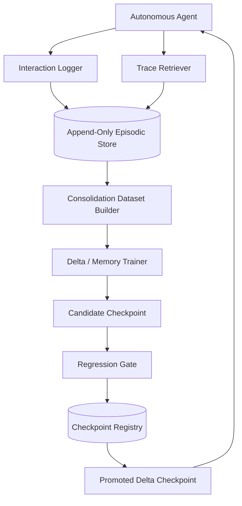

# Architecture

## Requirements Summary

Functional requirements:

- log interactions immediately
- retrieve prior interactions during operation
- build consolidation datasets from successful traces
- evaluate candidate checkpoints before promotion
- keep a durable record of promoted and rejected checkpoints

Non-functional requirements:

- append-only by default
- human-auditable
- easy to run locally
- safe-by-default promotion flow
- separable from live online self-editing

## High-Level Architecture

## Key Design Decisions

### Decision 1

Use append-only episodic storage as the always-on learning layer.

Reason:

- it preserves raw experience safely
- it avoids immediate model collapse from live self-editing

### Decision 2

Treat parametric updates as offline or gated consolidation.

Reason:

- current memory layers are not yet stable enough for unconstrained online updates
- promotion gates give us a rollback boundary

### Decision 3

Keep this system directory separate from the memory-layer research prototype.

Reason:

- the research loop and the agent-learning loop move at different speeds
- separation avoids entangling operational tools with experimental branches
