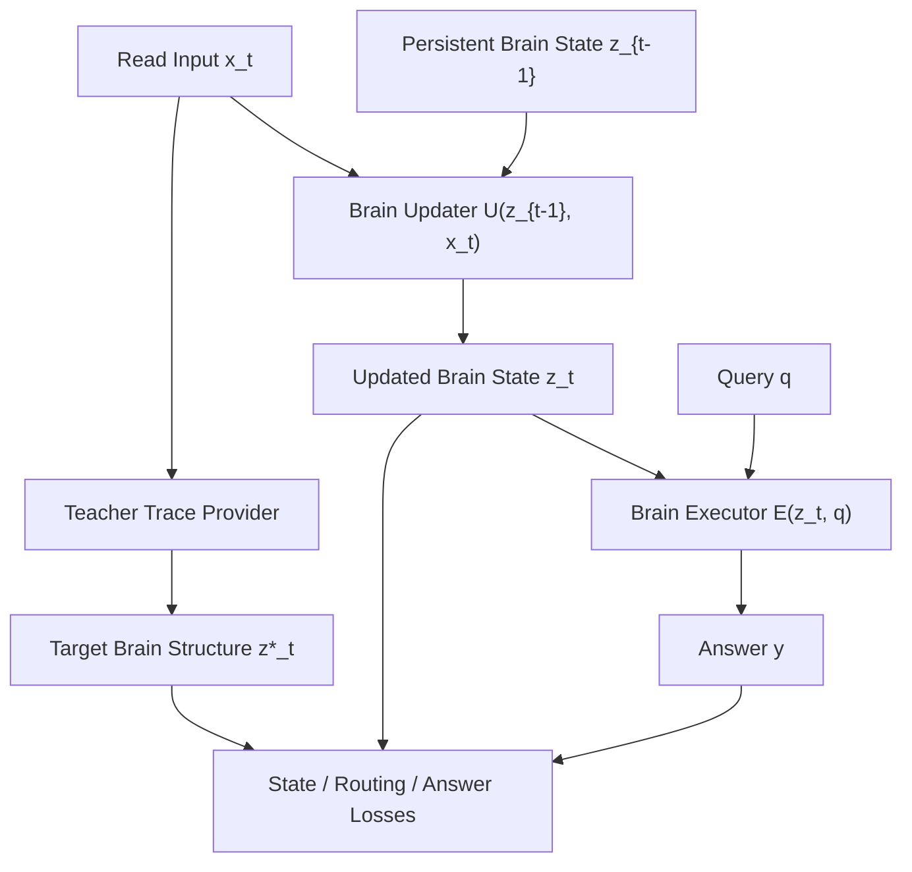

# Architecture

## Requirements Summary

Functional goals:

- ingest new text as a sequence of read events
- update a persistent latent brain state after each read event
- answer later queries from that state
- support teacher-side supervision over internal structure, not only output tokens

Non-functional goals:

- keep the representation executable and compact
- allow future replacement of the synthetic teacher with `Qwen 0.5B`
- make the first prototype simple enough to train locally

## High-Level Design

## Main Objects

### `BrainState`

Persistent latent memory represented as:

- `slots`: `[batch, num_slots, slot_dim]`
- `usage`: `[batch, num_slots]`

This keeps the state bounded and directly executable.

### `TeacherTraceProvider`

Current version:

- synthetic oracle teacher
- maps each `(entity, attribute)` pair to a teacher slot
- writes a fixed target content vector derived from the value

Real version:

- run `Qwen 0.5B`
- collect hidden states from selected layers
- pool them into per-read trace embeddings
- project those trace embeddings into latent slot contents
- compose teacher state by writing those contents into a persistent slot memory

### `BrainUpdater`

Learns `U(z, x) -> z'`.

Current implementation:

- token embedding + GRU over a read event
- router predicts which slot should update
- writer projects the read event into slot content space
- update gate controls write strength

### `BrainExecutor`

Learns `E(z, q) -> y`.

Current implementation:

- query encoder
- attention over latent slots
- classifier over value IDs

## Training Losses

- `answer_loss`: final query answer cross-entropy
- `state_loss`: MSE between student brain slots and teacher target slots
- `routing_loss`: cross-entropy for teacher slot prediction
- `query_slot_loss`: query-to-slot supervision
- `sparsity_loss`: entropy penalty over routing distribution

## Why This Matches The Original Idea

This prototype does not just route among frozen experts.

It explicitly models:

- a persistent brain state
- a read-time update process
- teacher-supervised internal structure
- later execution from that learned structure

The synthetic teacher is only a stand-in for the structure extractor, not the core idea.

## Real-Teacher Distillation Path

The `QwenTraceTeacher` path uses templated natural-language fact statements. For each read event:

- the teacher LLM receives the read text
- hidden states are captured at configurable layers
- the final token states are pooled into a trace vector
- the trace vector is projected into slot content
- a slot state is updated and used as teacher supervision

This gives a runnable version of:

- "observe real LLM activations"
- "compress them into structure"
- "train a second model to build that structure from input"
