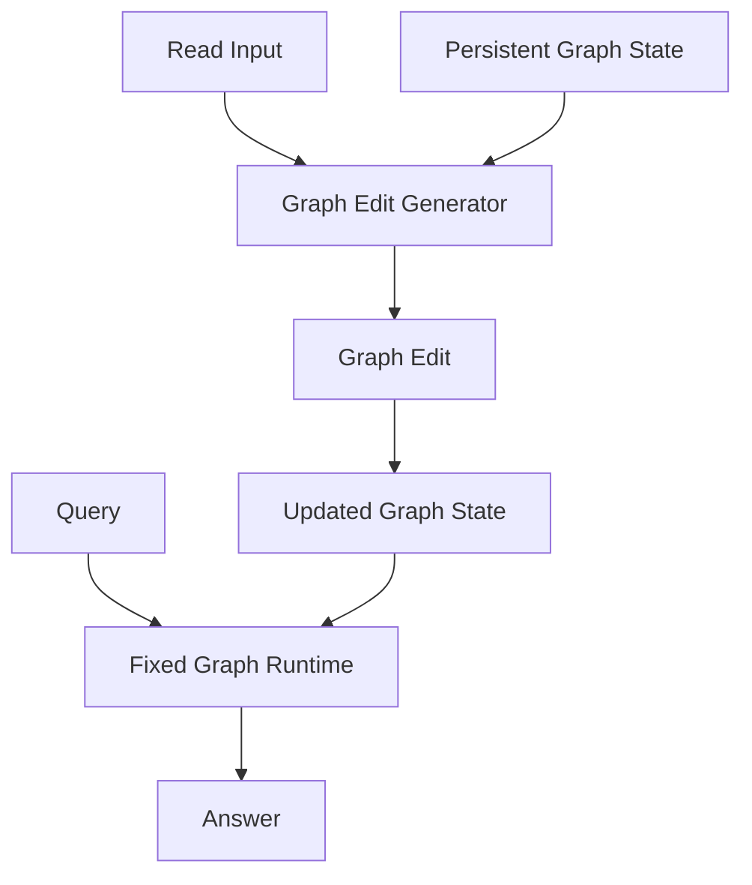

# Executable Graph Brain

## Motivation

The slot-memory path stores latent vectors that need a learned reader.

This path moves closer to the original goal:

- the generator writes an explicit graph
- the graph stores both content and computation structure
- a fixed runtime executes that graph with shared nonlinear node updates

So the persistent brain is no longer just "memory to decode later". It is an
object with executable structure.

## High-Level Architecture

## What The Generator Produces

For each read step, the generator emits graph edit decisions:

- source node
- target node
- allocate-new-node vs update-existing-node
- operator mixture for the connecting edge
- write vector for the target node
- gated nonlinear node update

After several read steps, the persistent state contains:

- `node_states`
- `node_active`
- `edge_strengths`
- `edge_operator_weights`

## What The Runtime Executes

At query time the runtime:

1. encodes the query
2. picks seed nodes
3. runs fixed rounds of message passing
4. applies nonlinear node updates using:
   - current node state
   - incoming messages
   - query-conditioned bias
5. reads out an answer from the propagated graph

The important distinction is that the runtime is generic. It does not learn a
new decoder after the generator is trained. The graph itself is what carries the
structure.

## Why Nonlinearities Matter

Purely linear propagation makes the graph behave too much like weighted
retrieval.

The runtime therefore uses nonlinear operator modules and nonlinear node update
cells so that:

- edges can change the meaning of information in transit
- repeated propagation can build compositional effects
- the graph can encode more than simple lookup

## Current Limitations

- node identities are still trained with synthetic supervision
- allocation is bounded by a fixed `num_nodes` budget
- the runtime is fixed, but still neural rather than symbolic
- this is the first executable version, not the final one
