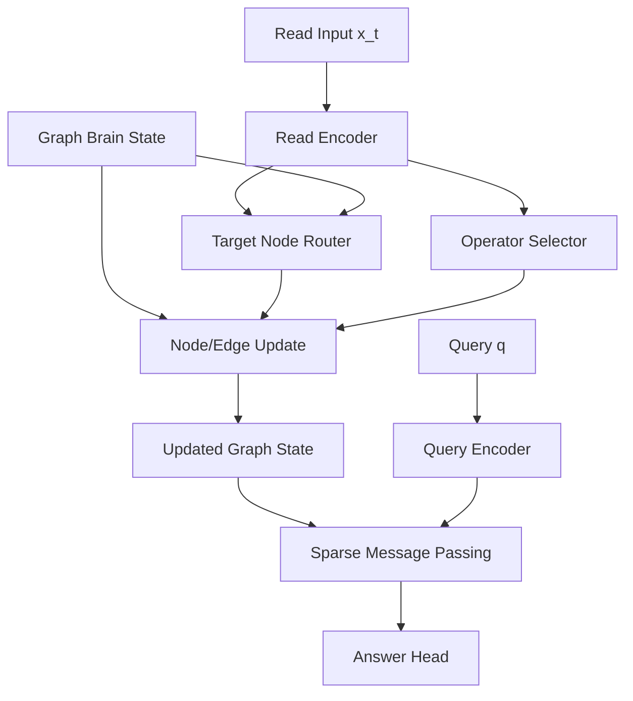

# Sparse Operator-Graph Brain

## Motivation

The slot-memory brain stores dynamic vectors, but not much computation.

To move closer to the original idea, `v2` stores:

- node states
- sparse edges between nodes
- per-edge operator mixtures

That means the persistent structure changes not only *what* is stored, but also *how information flows* during execution.

## High-Level Architecture



## Brain Structure

The persistent graph state contains:

- `node_states`: latent content vectors
- `edge_weights`: sparse adjacency strengths
- `edge_operator_weights`: per-edge mixtures over a fixed operator bank
- `last_node_weights`: previous active node distribution for sequential graph construction

This is still interpreted by a fixed outer model, but it is more executable than plain vector slots because the stored object shapes message passing.

## Update Rule

Each read event:

1. encodes the current input
2. predicts a target node
3. predicts an operator mixture
4. writes a new node state
5. adds or strengthens an edge from the previously active node to the new node

## Execution Rule

At query time:

1. encode the query
2. predict relevant node(s)
3. run one round of message passing using the stored sparse edges and operator mixtures
4. read out the answer from the propagated graph

## Current Limitations

- operator bank is fixed, not grown online
- node routing is still supervised by synthetic key IDs
- the graph is only lightly used by the answer path on the current task
- this is an investigation scaffold, not yet a final architecture

## Run

```bash
PYTHONPATH=src python3 scripts/train_graph_brain.py \
  --steps 200 \
  --batch-size 64 \
  --num-read-steps 6 \
  --unique-keys
```
